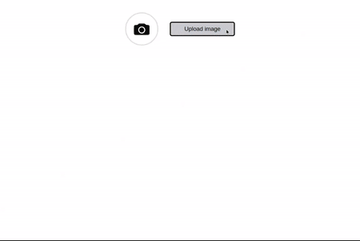

# Vue-Image-Crop-Upload

A Vue.js component for Image-Upload.

## Table of contents

- [Browser Support](#browser-support)
- [Demo](#demo)
- [Getting started](#getting-started)
- [Usage](#usage)
- [Available Props](#available-props)
- [Want to Contribute?](#want-to-contribute)
- [Need Help / Support?](#need-help)
- [Online Demo](#online-demo-of-vuejs-image-crop-upload)
- [Changelog](#changelog)
- [Credits](#credits)
- [License](#license)
- [Keywords](#Keywords)

## Browser Support

 |  |  |  |  |
--- | --- | --- | --- | --- | --- |
83.0 ✔ | 77.0  ✔ | 13.1.1 ✔ | 83.0 ✔ | 11.9 ✔ |

## Demo

[](https://github.com/weblineindia/Vue-Image-Crop-Upload/image.gif)

## Getting started

Install the npm package:

``` bash
npm install vue-weblineindia-image-crop-upload
#OR
yarn add vue-weblineindia-image-crop-upload
```

need css loader, ex: `sass-loader`, if you haven't installed :

```bash
npm install -D sass-loader node-sass
#OR
yarn add -D sass-loader node-sass
```

## Usage

Use the `<vue-weblineindia-image-crop-upload>` component:

```vue
<template>
  <div>
  <VueImageUpload/>
  </div>
</template>

<script>
// import vue-weblineindia-image-crop-upload
import VueImageUpload from 'vue-weblineindia-image-crop-upload'

export default {
  components: {
    VueImageUpload,
  },
}
</script>
```

## Available Props

| Prop | Type | default | Description |
| --- | --- | --- | --- |
| value | String |   | Set blob url  |
| id | String |   | id of the component |
| isCrop | boolean | true  |  Enables crop image |
| isRoundCrop | boolean | true  |  Use a round clipping area, this only effect the component layout, clipping results are still rectangular|
| acceptedFiles | Array | image, image/jpeg, image/jpg, image/png, png | Set image type |
| disableButton | boolean | false  | Set disable button |
| buttonName | String | Upload image  | Set image upload button name |
| imagesize | Number | 5000000 byte | Set size of image (byte) |
| imageUploadErrorMessage | String | Only jpg, jpeg and png are allowed. | Image format error message |
| imageSizeErrorMessage | String | Failed to upload an image. The image maximum size is 5MB. | Image Size error message |
| invalidImageErrorMessage | String | The uploaded image is not valid. | Invalid image error message |
| isLandscape | boolean | false  | Set landscape image |
| isPortrait | boolean | false  | Set Portrait image |

## Want to Contribute?

- Created something awesome, made this code better, added some functionality, or whatever (this is the hardest part).
- [Fork it](http://help.github.com/forking/).
- Create new branch to contribute your changes.
- Commit all your changes to your branch.
- Submit a [pull request](http://help.github.com/pull-requests/).

-----

## Need Help? 

We also provide a free, basic support for all users who want to use this VueJS Image Upload in their software project. In case you want to customize this Image Upload to suit your development needs, then feel free to contact our [VueJS developers](https://www.weblineindia.com/hire-vuejs-developer.html).

-----

## Online Demo of VueJS Image crop upload

We have also hosted this code on our website for a quick DEMO. Please click here for the demo of [VueJS Image Crop Upload](https://www.weblineindia.com/software-development-resources.html) online.

------

## Changelog

Detailed changes for each release are documented in [CHANGELOG.md](./CHANGELOG.md).

## Credits

vue-weblineindia-image-crop-upload is inspired by the [vuejs-clipper](https://www.npmjs.com/package/vuejs-clipper).

## License

[MIT](LICENSE)

[mit]: https://github.com/weblineindia/Vue-Image-Crop-Upload/blob/master/LICENSE

## Keywords

vue-weblineindia-image-crop-upload,vue-image-upload,vue,image-crop,vue-image-crop-upload
